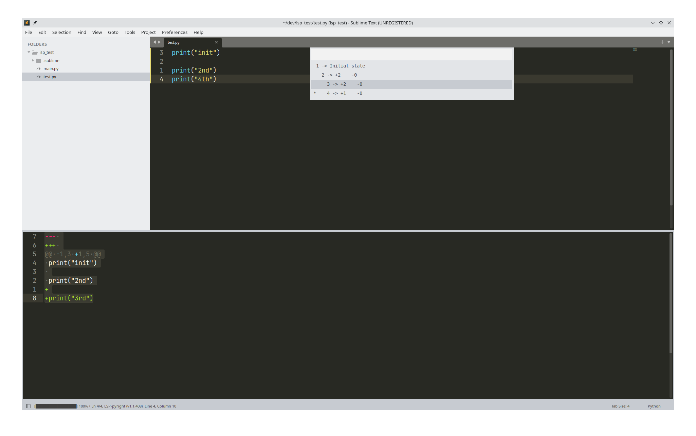

# UndoTree for Sublime Text

[](https://packagecontrol.io/packages/UndoTree)
[](https://www.sublimetext.com/)

A **Vim-style UndoTree plugin** for Sublime Text 4 (Python 3.8+), visualizing undo history as a **branching ASCII tree** with live diff previews.



---

## Features

- **Branching undo history** — every save creates a new node; multiple branches supported  
- **ASCII tree visualization** — shows the hierarchy of undo states using indentation and `-`  
- **Current node marker** — the active undo state is marked with `*`  
- **Sequential counters** — each node is numbered for easier reference (`1 -> +2 -0`)  
- **Live diff preview** — highlights changes when navigating the tree  
- **Restore any state** — select a node to restore its content in the editor  
- **Automatic initial snapshot** — captures file content on open  
- **Lightweight & Python-only** — no external dependencies  

---

## Installation

1. Place the plugin folder into your Sublime Text `Packages` directory:

   - **Linux:** `~/.config/sublime-text/Packages/`  
   - **Windows:** `%APPDATA%\Sublime Text\Packages\`  
   - **macOS:** `~/Library/Application Support/Sublime Text/Packages/`  

2. Restart Sublime Text.

---

## Usage

### Open UndoTree

- Open the command palette (`Ctrl+Shift+P` / `Cmd+Shift+P`) → **Show UndoTree**  
- The tree will appear in a **Quick Panel**, for example:

```
*1 -> Initial state
2 -> +2 -0
3 -> +1 -0
4 -> +3 -1
5 -> +1 -2
```


- `*` marks the current node  
- `->` separates the counter from the diff summary  

### Restore a Node

- Move the selection in the Quick Panel  
- Press **Enter** → restores the editor content to that node  
- Hovering over nodes shows a live **diff preview** in a separate panel  

### UndoTree Behavior

- Every **file save** creates a new node  
- Branches are automatically tracked if you modify the file from an older state  
- Initial file load automatically captures the starting state  

---

## Example Tree

```
*1 -> Initial state
2 -> +2 -0
3 -> +1 -0
4 -> +3 -1
5 -> +1 -2
```

- Shows indentation for branches  
- Current node is marked with `*`  
- Numbers help track node order  

---

## Commands

| Command | Description |
|---------|-------------|
| `show_undo_tree` | Opens the UndoTree Quick Panel |
| `undo_tree_restore` | Restore buffer content to a specific node |
| `undotree_write_preview` | Internal: writes live diff preview |
| `undotree_write_panel` | Internal: updates ASCII tree panel |

---

## Requirements

- **Sublime Text 4 / 3.8+**  
- Python 3.8+ (built-in with Sublime Text 4)  
- No additional dependencies  

---

## Notes

- ASCII tree uses **spaces and `-` only** for branch visualization, so it works in any font  
- Hover preview works with the **diff panel**  
- Branches can be navigated visually, but the Quick Panel does not allow full Vim-style j/k navigation yet  
